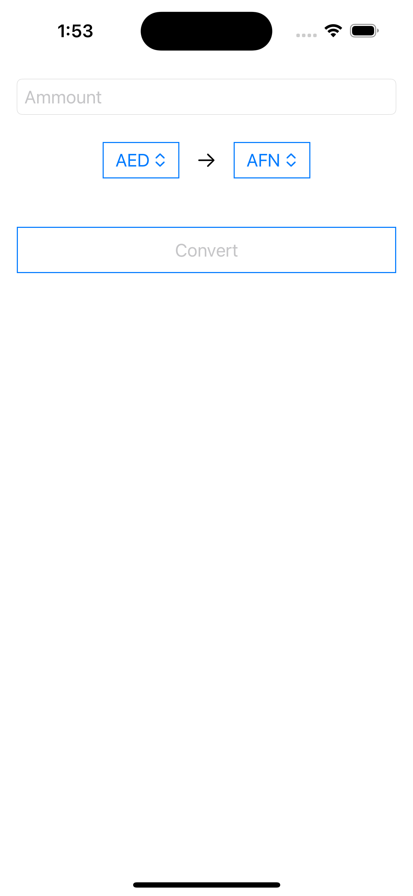
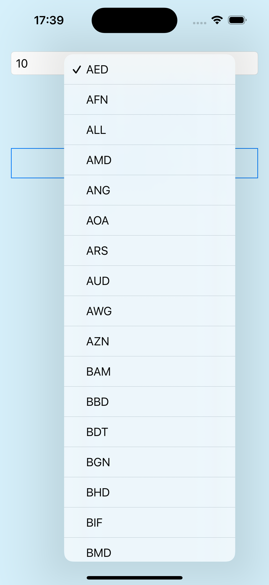

# CurrencyConverter_iOS
Currency converter application for iOS

#### 1. Page 1 - Home page
Input field - enter the amount which will be converted. 
Two Pickers - select currencies to convert between. 
Convert button - leads to Page 2. Disabled if there is no amount in the field. 

#### 2. Page 2 - Converter page
Two labels - with the selected currencies from Page 1. 
Arrow button (left arrow, right arrow) - change the direction of conversion. 
Convert button - perform the conversion according to the selected direction presented in the Arrow button. 
Show all currencies button - shows a list with all the currencies conversion of the selected currency. 

#### Video:
<a href="https://youtube.com/shorts/pjsb2q8GtYI?feature=share">Currency Converter Application Video<a/> 

#### Application screenshot: 

