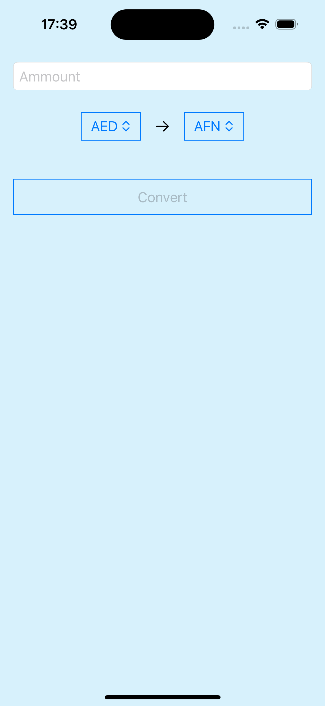

# CurrencyConverter_iOS
Currency converter application for iOS

#### 1. Page 1 - Home page
Input field - enter the amount which will be converted.
Two Pickers - select currencies to convert between.
Convert button - leads to Page 2. Disabled if there is no amount in the field.

#### 2. Page 2 - Converter page
Two - with the selected currencies from Page 1.
Arrow button (left arrow, right arrow) - change the direction of conversion.
Convert button - perform the conversion according to the selected direction presented in the Arrow button.
Show all currencies button - shows a list with all the currencies conversion of the selected currency.

#### Application screenshot: 

